# Chapter Four: Class and Sequence Diagrams

## 4.1 Introduction

This chapter presents the principal class relationships and runtime sequences used by CoffeeChain. The diagrams emphasise the private fertilizer tracking workflow, including dispatch, proof capture, OTP verification, receipt storage, blockchain anchoring, and auditing.

## 4.2 Class Diagrams

### 4.2.1 Core Domain Model

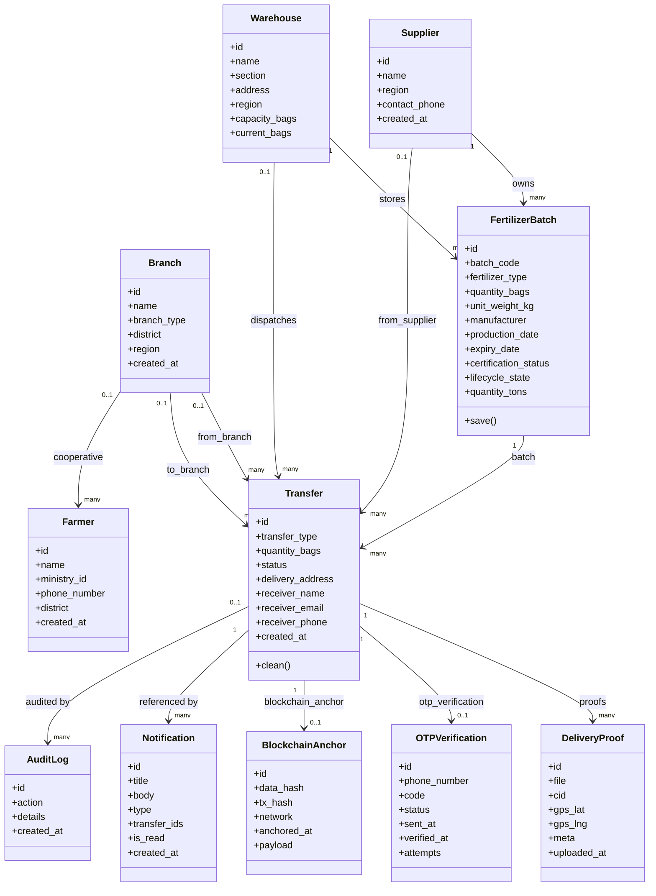

### 4.2.2 Service Layer and External Integrations

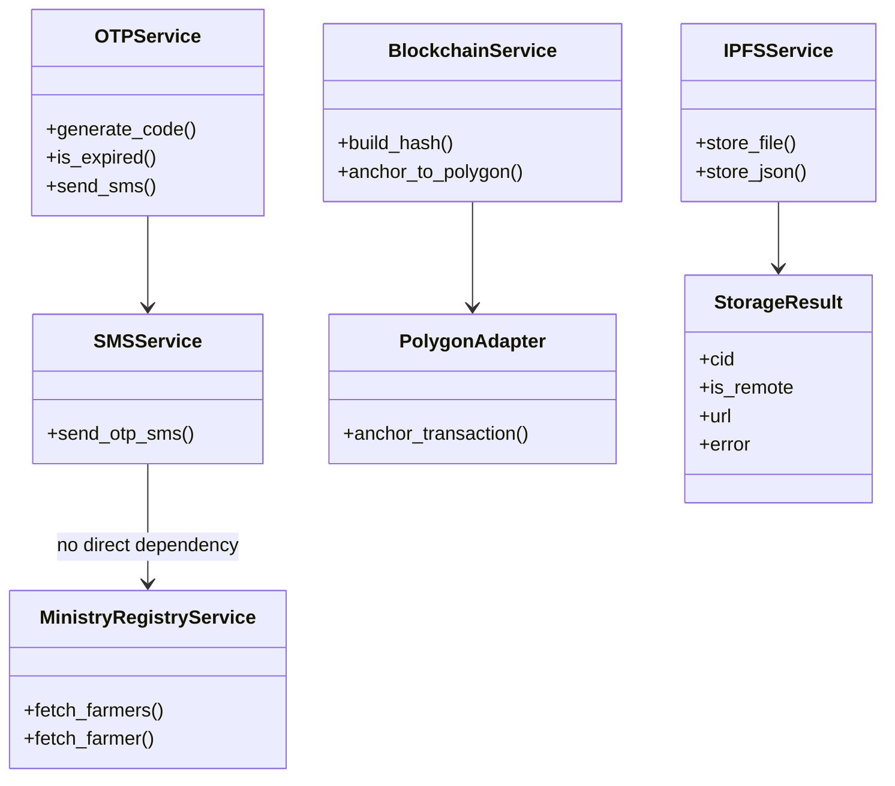

### 4.2.3 API Layer Overview

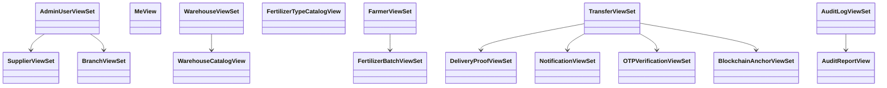

## 4.3 Sequence Diagrams

### 4.3.1 Admin Creates a User

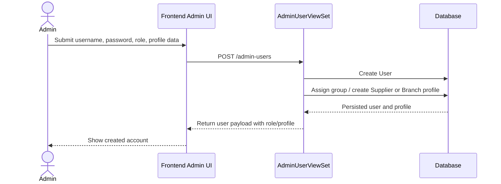

### 4.3.2 Supplier Creates and Dispatches a Batch

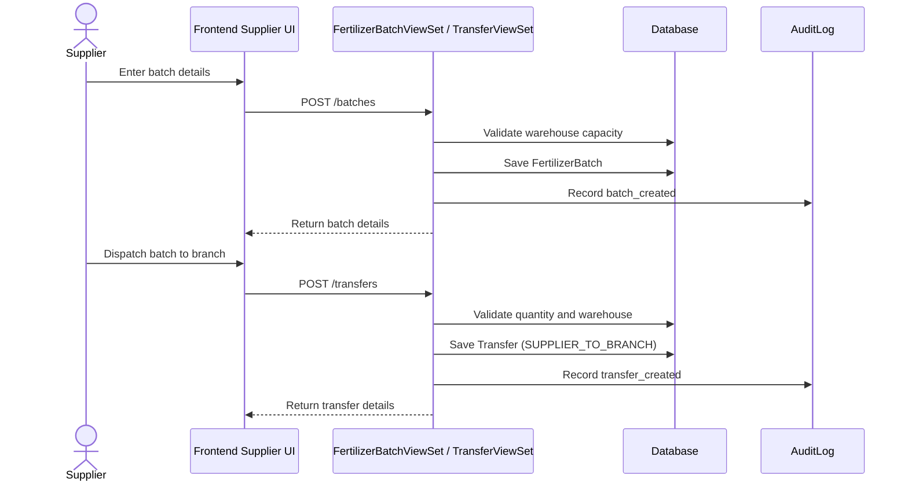

### 4.3.3 Branch Receives and Distributes to Farmer

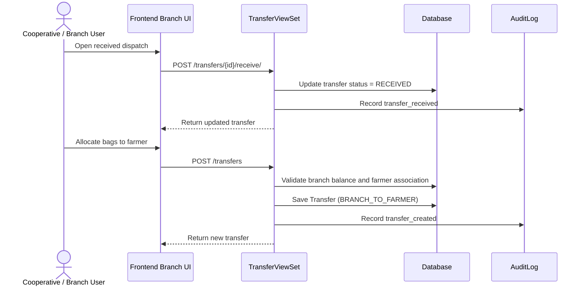

### 4.3.4 Farmer OTP Verification and Receipt Anchoring

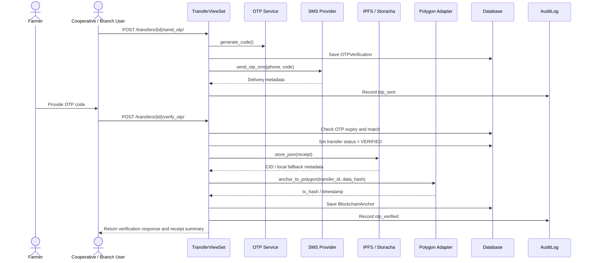

### 4.3.5 Upload Delivery Proof

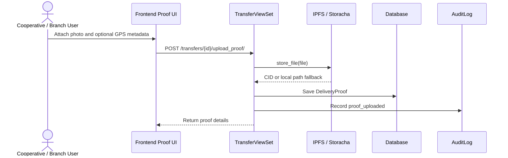

### 4.3.6 Lookup and Register Farmer

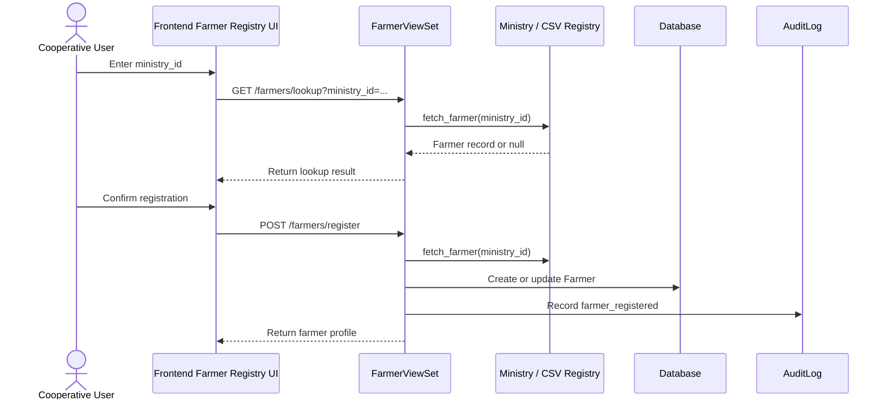

### 4.3.7 Notify Receiver of Dispatch

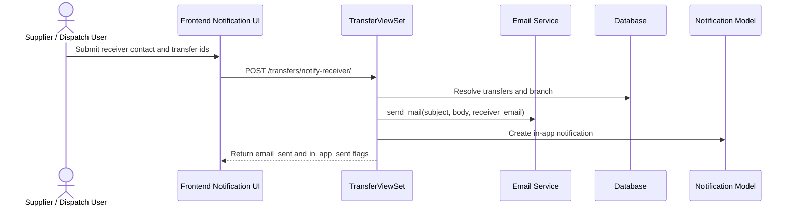

### 4.3.8 Generate Audit Report

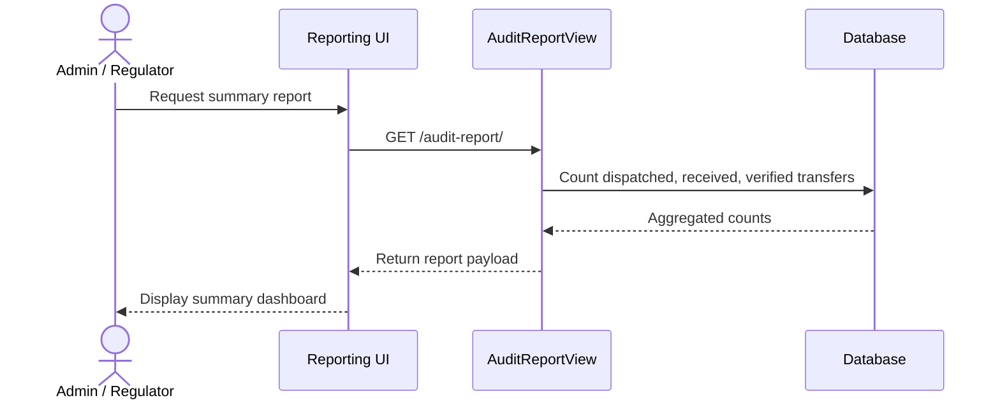

## 4.4 Notes on Coverage

- The class diagrams cover the core domain model, the service layer, and the main API entry points.
- The sequence diagrams cover the critical business flows currently implemented in the backend and visible in the frontend.
- A few product areas are not yet represented in code and therefore do not have fully implemented diagrams, including tenant onboarding, billing, advanced exports, and background retries.

## 4.5 File References

- Backend domain and services: [backend/supply_chain/models.py](backend/supply_chain/models.py), [backend/supply_chain/views.py](backend/supply_chain/views.py), [backend/supply_chain/services/ipfs.py](backend/supply_chain/services/ipfs.py), [backend/supply_chain/services/sms.py](backend/supply_chain/services/sms.py), [backend/supply_chain/services/otp.py](backend/supply_chain/services/otp.py), [backend/supply_chain/services/blockchain.py](backend/supply_chain/services/blockchain.py)
- Farmer directory source: [backend/supply_chain/services/ministry_of_agriculture.py](backend/supply_chain/services/ministry_of_agriculture.py)
- Frontend components: frontend/src/app/components
