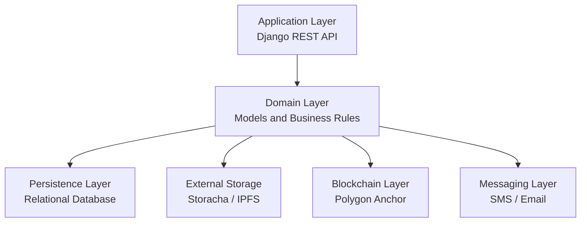
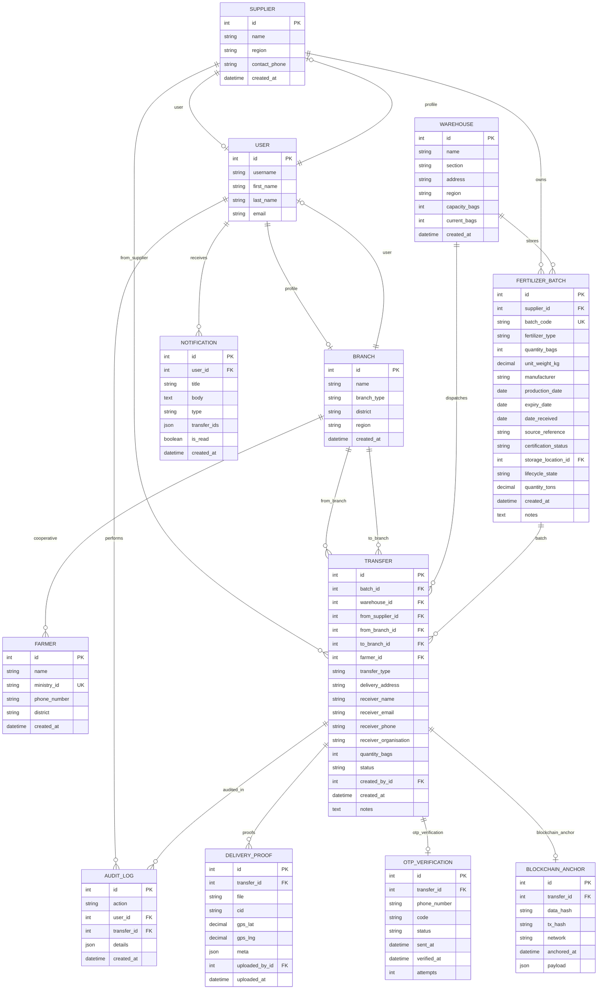

# Chapter Five: ERD and Database Architecture

## 5.1 Introduction

This chapter describes the database design used by CoffeeChain and presents the principal entities and relationships that support the private fertilizer tracking platform.

## 5.2 Database Architecture Overview

CoffeeChain uses Django with a relational database backend. The core data model is centered on fertilizer inventory, dispatch transfers, proof-of-delivery, verification, audit logging, and system notifications.

### 5.2.1 Architectural Notes

- **Database style:** Relational, normalized around core business entities.
- **Primary ORM:** Django ORM.
- **Storage strategy:** Transactional data is stored in the main database; files and receipts are stored off-chain in Storacha/IPFS or local media fallback when remote storage is unavailable.
- **Audit strategy:** Important actions are persisted as `AuditLog` records so operational activity can be traced.
- **Verification strategy:** OTP and blockchain anchor records are stored alongside transfer records to preserve traceability.

### 5.2.2 Logical Layers

## 5.3 Entity Relationship Diagram

## 5.4 Table-by-Table Summary

### 5.4.1 Supplier
- Stores supplier identity and contact details.
- Linked one-to-one with a Django user account.
- Owns many fertilizer batches and can originate transfers.

### 5.4.2 Branch
- Represents cooperatives, retailers, or regulatory branches.
- Stores branch type, district, and region.
- Linked one-to-one with a Django user account.
- Can receive supplier transfers and create branch-to-farmer transfers.

### 5.4.3 Farmer
- Stores farmer identity and ministry-style identifier.
- Optionally linked to a cooperative branch.
- Used during branch-to-farmer distribution and OTP confirmation.

### 5.4.4 Warehouse
- Stores warehouse capacity and operational contact details.
- Tracks current inventory in bags.
- Can contain multiple fertilizer batches.

### 5.4.5 FertilizerBatch
- Core inventory entity.
- Contains batch code, fertilizer type, quantity, weight, certification status, lifecycle state, and warehouse location.
- Computes `quantity_tons` from bag count and unit weight when not explicitly provided.

### 5.4.6 Transfer
- Represents movement of fertilizer through the supply chain.
- Supports supplier-to-branch and branch-to-farmer transfer types.
- Stores receiver details, status, warehouse, involved actor references, and quantity.

### 5.4.7 DeliveryProof
- Stores proof-of-delivery metadata, uploaded file reference, CID, GPS coordinates, and free-form metadata.

### 5.4.8 OTPVerification
- Stores OTP lifecycle details for farmer confirmation.
- Tracks attempts, sent time, verification time, and current state.

### 5.4.9 BlockchainAnchor
- Stores a cryptographic hash of the verification payload and blockchain transaction reference.
- Keeps a JSON payload summary for audit and traceability.

### 5.4.10 Notification
- Stores in-app notification content and the transfer IDs associated with the alert.
- Used to notify receiver branches about dispatches.

### 5.4.11 AuditLog
- Stores system events such as batch creation, transfer creation, OTP events, proof uploads, and verification.
- Used for operational traceability and reporting.

## 5.5 Relationship Summary

- A supplier can own many fertilizer batches.
- A fertilizer batch can have many transfers over its lifecycle.
- A transfer can have multiple proofs, but usually one OTP verification and one blockchain anchor.
- A warehouse can contain many batches and may be associated with transfer dispatches.
- A branch can both receive stock and dispatch to farmers.
- A farmer belongs to at most one cooperative branch at a time.
- Users receive notifications and generate audit records through system actions.

## 5.6 Keys, Constraints, and Data Integrity

- `ministry_id` in `Farmer` is unique.
- `batch_code` in `FertilizerBatch` is unique.
- `Supplier.user` and `Branch.user` are one-to-one links to authentication users.
- `Transfer.clean()` enforces required relationships depending on transfer type.
- Warehouse capacity is validated before adding or updating batch stock.
- OTP expiration and verification state transitions are handled in application logic.

## 5.7 Current Status

- **Implemented:** Core entities, transfer tracking, batch inventory, proof storage, OTP verification, blockchain anchor records, notifications, and audit logs.
- **Partially implemented:** Partner directory integration, advanced exports, background retries, and multi-tenant data isolation.
- **Not yet implemented:** Tenant/billing tables, usage metering, partner connector tables, and advanced analytics warehouse.

## 5.8 Files Referenced

- [backend/supply_chain/models.py](backend/supply_chain/models.py)
- [backend/supply_chain/views.py](backend/supply_chain/views.py)
- [backend/supply_chain/serializers.py](backend/supply_chain/serializers.py)
- [backend/supply_chain/services/ipfs.py](backend/supply_chain/services/ipfs.py)
- [backend/supply_chain/services/blockchain.py](backend/supply_chain/services/blockchain.py)
- [backend/supply_chain/services/otp.py](backend/supply_chain/services/otp.py)
- [backend/supply_chain/services/sms.py](backend/supply_chain/services/sms.py)
- [backend/supply_chain/services/ministry_of_agriculture.py](backend/supply_chain/services/ministry_of_agriculture.py)
